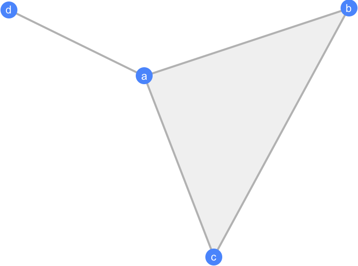
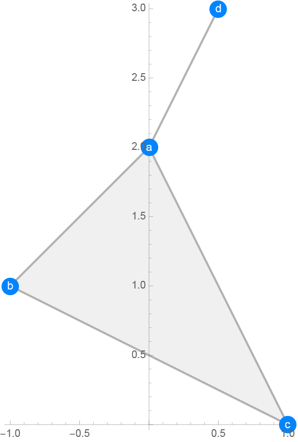
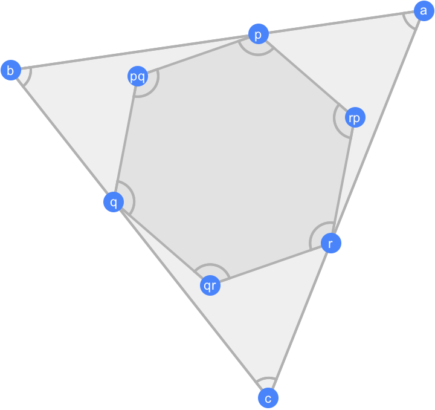
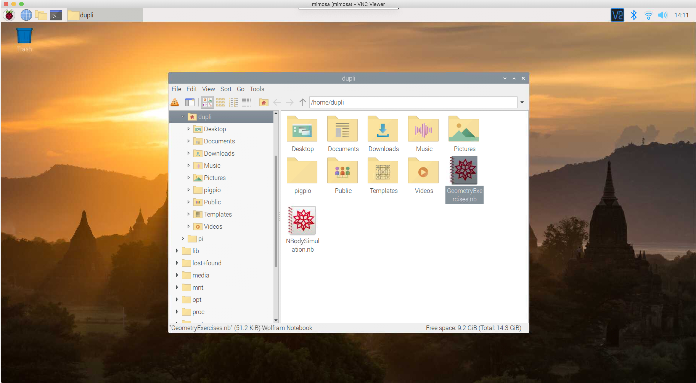
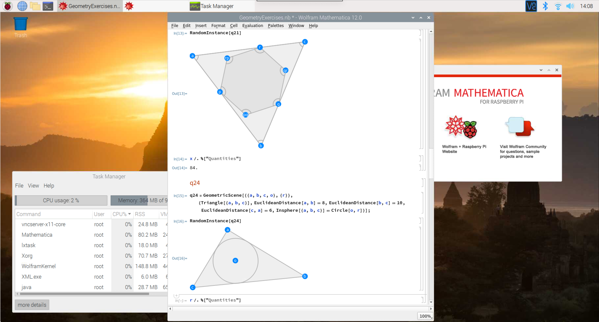

#Geometry exercises with Mathematica

Mathematica 12.0 became to be able to treat [Euclidean plane geometry](https://en.wikipedia.org/wiki/Euclidean_geometry) problems. The functions can handle geometric objects only with geometrical conditions without specifiying coordinate values. This repositry provides examples of geometry treatment of Mathematica 12.0 to play with geometrical objects or to help  your school homework of a geometry class. And especially [Mathematica](https://www.wolfram.com/raspberry-pi/) on [Raspbery pi](https://www.raspberrypi.org) also can handle them.

## Geometric setups

### Geometric objects

There are some geometric objects, i.e.,

- Line, HalfLine, InifiniteLine

- Circle

- Triangle

- RegularPolygon

- Polygon (general polygon)

- etc...

For example, a line from point 'a' to point 'b' is described as

```mathematica
Line[{a,b}]
```

###Geometric hypotheses

You can set geometric conditions between objects. There several ways to set the conditions. For example, to declear equality between lengths,

```mathematica
EuclideanDistance[a,b]==EuclideanDistance[c,d]
```

This statement says that distance between point 'a' and 'b' is squal to distance between 'c' and 'd'.

Other example, to declear angle value,

```mathematica
PlanarAngle[{a,b,c}]==Pi/2
```

This says angle between a line 'a' to 'b' and a line 'b' to 'c' is equal to Pi/2.

More complicated condition can be stated with a function GeometricAssersion. For example, 

```mathematica
GeometricAssersion[{Line[{a,b}],Line[{c,d}]}, {"Concurrent",p}]
```

says line a-b and line c-d cross at a point 'p'.

Other condition declarations can be referred in a [document](https://reference.wolfram.com/language/ref/GeometricScene.html).

###Object container

A function named GeometricScene is a container object of geometric objects.

```Mathematica
GeometricScene[{a,b,c,d},{Triangle[{a,b,c}],Line[{a,d}]}]
```

says that here are four points a, b, c and d, three points a, b and c form a triangle and a point d is tied with al line to the point a. General syntax of GeometricScene is in a  [document](https://reference.wolfram.com/language/ref/GeometricScene.html).

## Object drawing

You can draw geometric objects with a function RandomInstance, for example,

```mathematica
scene = GeometricScene[{a,b,c,d},{Triangle[{a,b,c}],Line[{a,d}]}];
RandomInstance[scene]
```

then you can see such like,



Positions of points wtih no specified coorinates are selected randomly.

Also you can specify the coordinates,

```Mathematica
scene = GeometricScene[{a -> {0, 2}, b -> {-1, 1}, c -> {1, 0}, 
    d -> {1/2, 3}}, {Triangle[{a, b, c}], Line[{a, d}]}];
Show[RandomInstance[scene]["Graphics"], Axes -> True]
```



# Exercises

## Simple example

As an example, I choose a [workbook](http://www.suguru.jp/figure100/) for elemntary school students. This site is in Japanese but pdf files in the site are so simple to understand thier meaning. Here is question No.21 in [pdf](http://www.suguru.jp/www.monjirou.net/figure100/figure21_24.pdf), a hexagon tangents a triangle and three apexes of the hexagon are on all sides of triangle and  tangented apexes of the hexagon divide each side of the triangle into 2:3.

```Mathematica
q21 = GeometricScene[{{a, b, c, p, q, r, pq, qr, 
     rp}, {x}}, {RegularPolygon[{a, b, c}], 
    RegularPolygon[{p, pq, q, qr, r, rp}], Element[p, Line[{a, b}]], 
    Element[q, Line[{b, c}]], Element[r, Line[{c, a}]], 
    3 EuclideanDistance[a, p] == 2 EuclideanDistance[p, b], 
    Area[RegularPolygon[{a, b, c}]] == 150, 
    Area[RegularPolygon[{p, pq, q, qr, r, rp}]] == x}];
    RandomInstance[q21]
```

shows a shape like



Its question is what is area of hexagon when area of the triangle is 150 square sentimeters. You can find the  answer by

```mathematica
x/.RandomInstance[q21]["Quantities"]
```

then you can get a correct answer "84".

##Try on Raspberry pi

Mathematica 12.0 is now avaliable on raspberry pi (raspbian stretch/buster). You can download a file named "GeometryExercises.nb" from this repositroy and copy in a appropiate directory on your rasbperry pi,



and double click the copied file, then select each bracket on the right side of the window and press shift-enter to evaluate codes in the bracket.



Have fun.

# external links

##Mathematica documents

[GeometricScene](https://reference.wolfram.com/language/ref/GeometricScene.html)

[RandomInstance](https://reference.wolfram.com/language/ref/RandomInstance.html)

[GeometricAssertion](https://reference.wolfram.com/language/ref/GeometricAssertion.html)

[GeometricScene Tutorial](https://reference.wolfram.com/language/tutorial/SyntheticGeometry.html)
##Workbooks

[Workbook for examination](http://www.suguru.jp/figure100/) (in Japanese)

